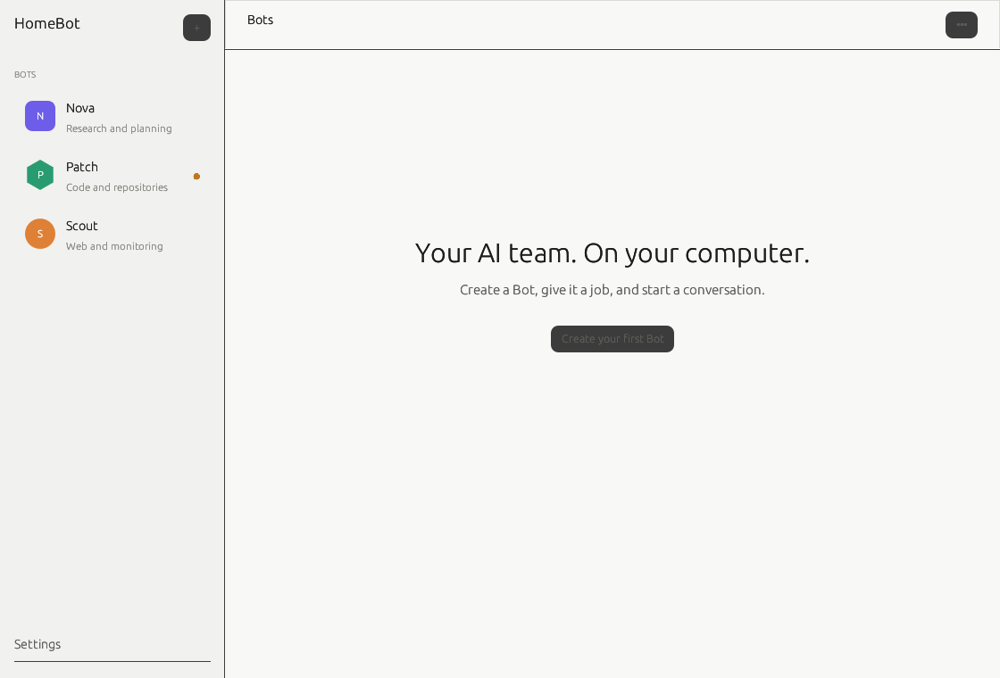
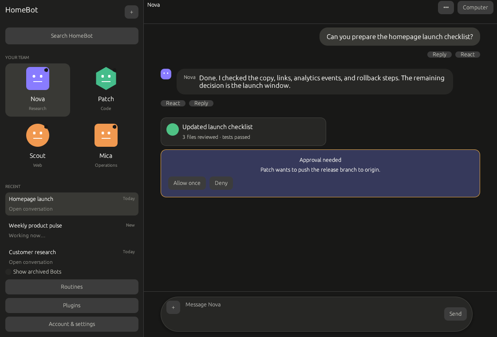
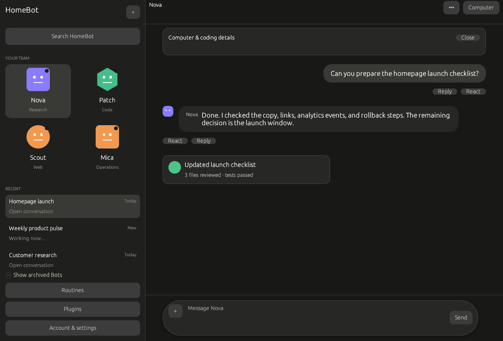

# HomeBot

[](LICENSE)
[](https://github.com/luinbytes/HomeBot/actions/workflows/ci.yml)
[](https://github.com/luinbytes/HomeBot/commits/main)
[](https://github.com/luinbytes/HomeBot)
[](https://github.com/luinbytes/HomeBot/issues)
[](https://github.com/luinbytes/HomeBot/stargazers)

## Your AI team. On your computer.

HomeBot is an open-source home for persistent AI teammates. Create Bots, message them like people, put specialists in a group chat, and let them hand work to each other while your own Mac or Linux machine remains the computer they work on.

Bring the providers you already use, including Codex CLI, Claude Code, and OpenAI-compatible APIs. Attach a repository when a Bot needs coding powers. Turn a good workflow into a routine. Check in from the native desktop app or, as M5 lands, the native Android client over your LAN or Tailscale. Your chats, files, credentials, and execution history stay under your control.

> HomeBot is under active development and is not yet a v1 release. There are no supported release packages yet. Development builds bind conservatively and use authenticated server APIs, but they should still be treated as pre-release software.

## Desktop preview

Real renders from HomeBot's cross-platform desktop visual-regression suite.

| Bot roster | Chat and activity | Coding workflow |
| --- | --- | --- |
|  |  |  |

### What already works in development

- Persistent, customisable Bots with durable direct chats and group coordination
- Bring-your-own Codex, Claude Code, OpenAI-compatible, and community process backends
- Authenticated Rust HTTP/WebSocket server with snapshots, replay, reconnect, idempotent mutations, attachments, and cancellation
- Native Rust/egui desktop client backed by the authoritative server rather than local-only app state
- Skills, plugins/MCP connections, OS-backed secrets, recorded routines, schedules, triggers, and durable run history
- Local filesystem, PTY/terminal, browser, and approval-gated computer capabilities
- Repository workspaces and isolated worktrees per coding chat
- Turn checkpoints, exact diffs, safe restore, Git status/commit/branch/push, and pull-request workflows
- Durable queued steering, provider interaction modes, and working-context compaction/reset controls
- Short-lived pairing credentials and named, revocable device sessions for LAN/Tailscale-style remote access
- Server-enforced permissions and structured approvals

### Still in progress before v1

- The first-class native Android client and full mobile parity
- Android notifications, background reconnect, deep links, routines/plugins/settings, and device management
- macOS Intel/Apple Silicon release packaging and signing/notarisation
- Arch/Omarchy packaging and headless service distribution
- Updater, migration recovery, performance/accessibility budgets, security hardening, and the final parity gate
- Real authenticated Codex CLI and Claude Code release smoke tests on environments where those providers are installed

The hosted cloud VM is the one intentional Grok Bot parity exclusion. Your HomeBot host replaces it.

## Status and installation

HomeBot is currently in **M6: Packaging, Hardening & v1 Parity Gate**. M0 through M5 are complete. Native macOS/Arch package pipelines and migration/update recovery are active release workstreams.

There are still **no supported release packages**. Follow [INSTALL.md](INSTALL.md) for human installation status or [AGENT_INSTALL.md](AGENT_INSTALL.md) for deterministic automation instructions. Release readiness is tracked against [the parity matrix](docs/parity-matrix.md).

Supported v1 targets are macOS x86_64 and arm64, Linux x86_64 with Arch/Omarchy first-class, headless macOS/Linux, and Android.

### Roadmap snapshot

| Milestone | Status |
| --- | --- |
| M0 · Product & Architecture Baseline | Complete |
| M1 · Local Runtime Foundation | Complete |
| M2 · Grok Bot Desktop Parity | Complete |
| M3 · Routines, Skills & Plugins | Complete |
| M4 · T3 Code Developer Superpowers | Complete |
| M5 · Android & Remote Parity | Complete |
| M6 · Packaging, Hardening & v1 Parity Gate | In progress |

## Architecture

The Rust server is authoritative. It owns Bot/chat state, providers, permissions, tools, routines, plugins, secrets, browser and terminal execution, Git operations, device sessions, remote pairing, and persistence. Desktop and Android consume the same versioned HTTP and WebSocket protocol. The desktop app can supervise a bundled local server but does not bypass server contracts.

Coding chats can attach an existing repository directly or use a deterministic isolated Git worktree. HomeBot preserves dirty primary trees and refuses to remove an isolated worktree containing uncommitted work. See [Repository workspaces](docs/workspaces.md).

| Area | Responsibility |
| --- | --- |
| `homebot-domain` | Provider-independent Bots, chats, activities, approvals, and routines |
| `homebot-protocol` | Versioned client/server messages and compatibility rules |
| `homebot-storage` | SQLite migrations, repositories, outbox, device sessions, and recovery |
| `homebot-server` | Authenticated HTTP/WebSocket API and headless process |
| `homebot-providers` | Codex, Claude Code, BYOK, and community adapter boundary |
| `homebot-secrets` | macOS Keychain/Linux Secret Service storage and redacted provider injection |
| `homebot-tools` | Server-enforced filesystem, PTY, browser, plugin, and secret capabilities |
| `homebot-vcs` | Workspaces, worktrees, checkpoints, diffs, and safe source control |
| `homebot-desktop` | Native egui client, authenticated transport, and local-server supervision |
| `android/` | Native Kotlin/Compose client, resumable protocol transport, Android Keystore device session, and server-backed feature projections |

Bots own stable HomeBot identity and app-managed history. A provider profile maps a Bot/chat to backend-specific conversations; switching providers does not replace the Bot.

Large artifacts live in a content-addressed application data directory. SQLite is the durable source of truth for application state and an outbox provides sequenced, resumable events. Secret values are never stored in normal SQLite rows; the database holds opaque references to macOS Keychain or a Linux Secret Service-compatible store. See [secret storage](docs/secrets.md).

Remote clients pair with a short-lived, single-use credential and receive a named, revocable device session. HomeBot binds to loopback by default and requires explicit opt-in for broader listeners. Private-network access such as Tailscale is the recommended remote path.

See [remote access and pairing](docs/remote-access.md) for the current server/desktop flow and conservative listener controls.

Read the deeper contracts:

- [Architecture](docs/architecture.md)
- [Desktop visual system](docs/desktop-visual-system.md)
- [Desktop settings and notifications](docs/desktop-settings.md)
- [Protocol](docs/protocol.md)
- [Group chats and coordination](docs/group-chats.md)
- [Activity and artifact surfaces](docs/activity-surfaces.md)
- [Providers](docs/providers.md)
- [Secret storage](docs/secrets.md)
- [Local computer capabilities](docs/tools.md)
- [Repository workspaces](docs/workspaces.md)
- [Turn checkpoints, diffs, and restore](docs/checkpoints.md)
- [Source control and pull requests](docs/source-control.md)
- [Queued work and provider context](docs/working-context.md)
- [Updates, migration backup, and recovery](docs/recovery.md)
- [Security and threat model](docs/security.md)
- [Android](docs/android.md)
- [Routines](docs/routines.md)
- [Skills](docs/skills.md)
- [Plugins](docs/plugins.md)
- [Development](docs/development.md)
- [Releasing](docs/releasing.md)

## Development

Prerequisites: Rust stable, Git, and platform build dependencies. Android work additionally requires JDK 17 and the Android SDK.

```bash
cargo fmt --all --check
cargo clippy --workspace --all-targets --all-features -- -D warnings
cargo test --workspace --all-features
cargo run -p homebot-server
curl --fail --silent http://127.0.0.1:7123/health
```

Protocol models are Rust-owned. Every protocol change must update the machine-readable schema, golden fixtures, compatibility notes, and Android mechanical validation before merge.

Provider implementations conform to `ProviderAdapter`. Provider-specific process or API events are normalised before crossing the client boundary. See [providers.md](docs/providers.md) before adding an adapter.

HomeBot is MIT licensed. T3 Code is architectural inspiration and is also MIT licensed; HomeBot does not copy proprietary Grok Bot code or assets. See [CONTRIBUTING.md](CONTRIBUTING.md) and [SECURITY.md](SECURITY.md).
